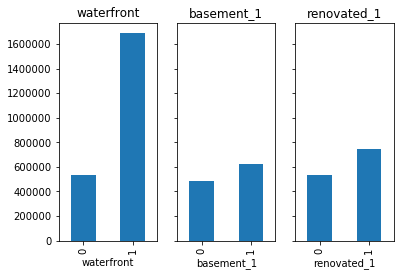

{
 "cells": [
  {
   "cell_type": "markdown",
   "metadata": {},
   "source": [
    "# King County Housing Prices\n",
    "\n",
    "## Overview\n",
    "\n",
    "This project seeks to develop a predictive model in order for housing prices in King County, Washington. Investigation and final modeal are based on the file `'kc_house_data_test_features.csv'`, which is a dataframe of houses sold in 2014 and 2015 in King County, Seattle.\n"
   ]
  },
  {
   "cell_type": "markdown",
   "metadata": {},
   "source": [
    "## Business Problem\n",
    "We will explore the following business questions:\n",
    "\n",
    "- How does the number of bedrooms and bathrooms determine the selling price of a house?\n",
    "\n",
    "- How does the condition of a house determine selling price?\n",
    "\n",
    "- How does the square footage determine selling price?\n",
    "\n",
    "- Does renovation influence the selling price?"
   ]
  },
  {
   "cell_type": "markdown",
   "metadata": {},
   "source": [
    ""
   ]
  },
  {
   "cell_type": "markdown",
   "metadata": {},
   "source": [
    "## Analysis\n",
    "\n",
    "A first look at an initial heatmap of our features immediately shows the most meaningful correlations to price are the square footage of the living space (`sqft_living`), and the building construction rating (`grade`). Trailing closely behind we can also see that bathrooms and view, \n",
    "- **highest correlations:** 'bathrooms', 'sqft_living', 'grade', 'sqft_above', 'sqft_living15' \n",
    "    - check for outliers and extreme values\n",
    "    - sqft_living seems like a better predictor, interact this variable with others\n",
    "- **low correlations to check out:** 'bedrooms', 'waterfront', 'view', 'condition', 'renovation' \n",
    "    - see if manipulation helps with correlation\n",
    "        - create dummy variables for renovation, view, condition"
   ]
  },
  {
   "cell_type": "markdown",
   "metadata": {},
   "source": [
    "## Exploratory Data Analysis\n",
    "- Reign in outliers for variables with sqft\n",
    "- Inspect extreme outliers:\n",
    "    - '11' and '33' bedrooms \n",
    "    - '0' bathrooms\n",
    "- Investigate binomial variables using statistical tests\n",
    "- Generate new features that will be useful"
   ]
  },
  {
   "cell_type": "markdown",
   "metadata": {},
   "source": [
    ""
   ]
  },
  {
   "cell_type": "markdown",
   "metadata": {},
   "source": [
    "There is a stark increase in value for waterfront property as opposed to inland. It can also be determined that there is a statistically significant increase in price for homes that have a basement and homes that have been renovated."
   ]
  },
  {
   "cell_type": "markdown",
   "metadata": {},
   "source": [
    "## Findings\n",
    "\n",
    "We can deduce that the highest selling homes have larger than average interior square footage and are in neighborhoods surrounded by other large homes, and/or where a high level of attention is paid to construction grade.\n",
    "\n",
    "I was particularly suprised that a property's view, condition quality rating, and the number of bedrooms were fairly weak indicators of price. With the unexplainable outliers within this dataset, we may need additional information in order to better fit our model. \n"
   ]
  },
  {
   "cell_type": "markdown",
   "metadata": {},
   "source": [
    "## Next Steps\n",
    "I would like to take a closer look at outliers in order to bin categories to keep the model more streamlined. I would also seek outside sources such as information on school districts, records of parks, and local attractions."
   ]
  }
 ],
 "metadata": {
  "kernelspec": {
   "display_name": "Python 3",
   "language": "python",
   "name": "python3"
  },
  "language_info": {
   "codemirror_mode": {
    "name": "ipython",
    "version": 3
   },
   "file_extension": ".py",
   "mimetype": "text/x-python",
   "name": "python",
   "nbconvert_exporter": "python",
   "pygments_lexer": "ipython3",
   "version": "3.6.9"
  }
 },
 "nbformat": 4,
 "nbformat_minor": 4
}
